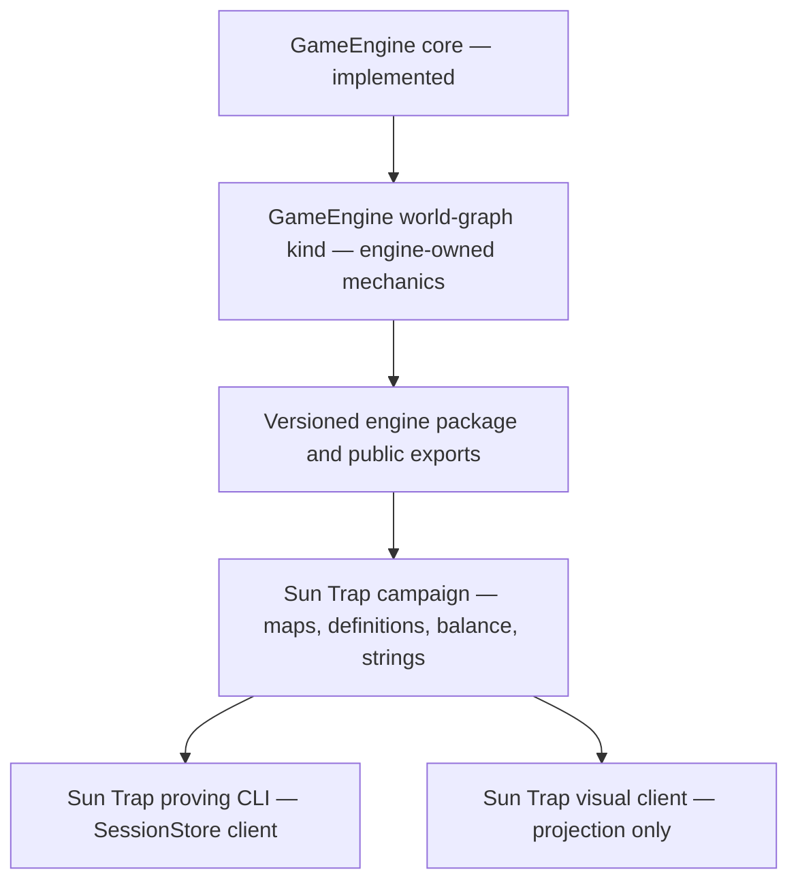

# Sun Trap — Implementation Programme

**Document status:** Active plan

> **Scope**
> The ordered, checkable programme that takes Sun Trap from design documents to a proven
> headless game. It coordinates work in this repository with the engine-owned
> `world-graph` implementation in
> [SubZeroDev.GameEngine](https://github.com/The-Running-Dev/SubZeroDev.GameEngine).

---

## 1. How to Use This Programme

This document is the implementation source of truth. The
[roadmap](roadmap-risks-and-open-questions.md) describes product phases, risks and open
questions; this document defines dependency order, deliverables and completion evidence.

- Check a task only after its implementation and named verification have passed.
- Check a milestone only after every task in its **Gate** is complete.
- Record the pull request, commit or test that proves a cross-repository task when checking
  it. A statement that work exists is not evidence.
- Tasks marked **GameEngine** change the companion engine repository. Tasks marked
  **Sun Trap** change this repository.
- A milestone may be split into smaller pull requests, but no later milestone may depend on
  an unchecked gate.
- Balance values remain provisional until M9. Completing an earlier milestone proves
  mechanics, not fun or balance.

### 1.1 Verified Starting Point

- [x] **GameEngine:** the shared engine MVP is implemented and its authoritative roadmap
      marks W1–W19 complete.
- [x] **GameEngine:** the current local implementation passes build, typecheck, lint and
      677 tests across 57 test files (verified 2026-08-02).
- [x] **GameEngine:** the `world-graph` seam, tick order, actions, determinism rules,
      projection boundary, reason codes and events are specified.
- [x] **Sun Trap:** the vision, game design, client contract, MVP and field-level design are
      documented.
- [ ] **GameEngine:** a production `world-graph` kind exists.
- [ ] **GameEngine:** the engine has a supported package/export surface for companion games.
- [ ] **Sun Trap:** this repository contains executable TypeScript game content or a client.

---

## 2. Architecture for Implementation



### 2.1 Ownership Boundary

| Concern | Owner | Rule |
|---|---|---|
| Envelope, RNG, serialization, sessions, saves, replay | GameEngine core | Never reimplemented here |
| Tick pipeline, pathfinding, utility selection, queues, staff work | GameEngine `world-graph` kind | Reviewed engine code, not campaign data |
| Minimum state and content interfaces interpreted by the kind | GameEngine `world-graph` kind | One authoritative type definition |
| Maps, scenarios, definitions, strings and balance values | Sun Trap | Concrete campaign data satisfying engine types |
| Proving CLI and visual client | Sun Trap | Calls the session surface and renders projections only |
| Long-running balance search | Sun Trap | Never part of registry validation |

The engine must own the minimum TypeScript interfaces its kind reads. Sun Trap owns the
values that satisfy those interfaces and may add authoring helpers, but it must not copy or
fork the engine's mechanical types.

### 2.2 Dependency Rule

Sun Trap depends on a versioned GameEngine package. GameEngine never imports Sun Trap.
During local development the package may be linked from the sibling checkout, but CI must
resolve an immutable version or commit and must not depend on a developer's directory
layout.

### 2.3 The Acceptance Thread

Every milestone advances one executable thread:

```text
small beach map
→ place a drink stand and toilet
→ spawn a thirsty guest
→ choose a reachable drink stand
→ walk and queue
→ buy a drink and create litter
→ dispatch a cleaner
→ restore cleanliness
→ meet the revenue/cleanliness objective or fail financially
```

Features that do not help prove this thread stay outside the MVP.

---

## 3. Milestones

## M0 — Contract and Programme Reconciliation

**Outcome:** implementation begins from current facts and one agreed boundary.

- [x] **Sun Trap:** add this implementation programme and make it the checklist source of
      truth.
- [x] **Sun Trap:** distinguish the implemented engine core from the unimplemented
      `world-graph` kind in repository status text.
- [ ] **GameEngine:** resolve the `tick_limit_exceeded` versus `tick_limit_reached` reason
      code inconsistency in the World Graph contract.
- [ ] **GameEngine:** record that mechanical interfaces interpreted by `world-graph` are
      engine-owned while concrete Sun Trap values remain game-owned.
- [ ] **GameEngine:** choose and document the companion-package delivery mechanism.
- [ ] **Sun Trap:** decide the MVP questions in §4 before their owning milestone begins.

**Gate**

- [ ] Both repositories describe the same ownership boundary and use the same reason-code
      vocabulary.
- [ ] The package strategy is explicit enough for M1 to implement without another
      architectural decision.

---

## M1 — Engine Consumer Boundary

**Outcome:** a companion repository can build against a supported, versioned GameEngine
surface.

- [ ] **GameEngine:** add a public package entry point.
- [ ] **GameEngine:** export the core construction, registry, session, projection and client
      types required by a game without exposing test fixtures as public API.
- [ ] **GameEngine:** define package `exports`, declarations and build artefacts.
- [ ] **GameEngine:** choose whether the package remains private in a package registry or is
      distributed by immutable Git reference.
- [ ] **GameEngine:** add a consumer smoke fixture that imports only public exports.
- [ ] **GameEngine:** make package build and consumer smoke verification required in CI.
- [ ] **Sun Trap:** add the immutable engine dependency only after the public surface exists.

**Gate**

- [ ] A clean consumer project installs, imports, typechecks and constructs the engine using
      only supported exports.
- [ ] CI does not rely on a sibling checkout or mutable branch.

---

## M2 — World Graph Types and Kind Skeleton

**Outcome:** GameEngine recognizes a real `world-graph` kind and can create and validate a
minimal world.

- [ ] **GameEngine:** define authoritative map, entity, finance and world-state types.
- [ ] **GameEngine:** define the minimum campaign/content interfaces required by the MVP.
- [ ] **GameEngine:** define `WorldGraphView` and terminal outcome types.
- [ ] **GameEngine:** implement the reason-code and event-name registries.
- [ ] **GameEngine:** implement campaign narrowing and pure Tier 1/Tier 2 validation.
- [ ] **GameEngine:** implement `initialState`, `outcome` and the production
      `worldGraphKind` assembly.
- [ ] **GameEngine:** register a synthetic one-map campaign fixture for engine tests only.
- [ ] **GameEngine:** reject malformed campaign content without throwing.

**Gate**

- [ ] `createGame` produces a deterministic tick-zero world through the real kind.
- [ ] A broken map, missing reference and invalid tick cap each fail with the expected
      validation result.
- [ ] The engine's build, typecheck, lint and complete test suite pass.

---

## M3 — Map Placement and Preview

**Outcome:** the player can inspect and place the MVP buildings through authoritative engine
rules.

- [ ] **GameEngine:** implement footprint rotation and entrance resolution.
- [ ] **GameEngine:** implement bounds, overlap, terrain, unlock and affordability checks.
- [ ] **GameEngine:** implement `build` with immediate MVP construction.
- [ ] **GameEngine:** derive building and queue ids from `nextEntityOrdinal`.
- [ ] **GameEngine:** add `previewAction` as the real action path with discarded state.
- [ ] **GameEngine:** add `previewAction` to the session surface, text client coverage and MCP
      surface in the same change.
- [ ] **GameEngine:** project the build catalogue, costs, unlock state and price ranges.
- [ ] **GameEngine:** test every placement reason code and preview/submit parity.

**Gate**

- [ ] The same parameters accepted by preview are accepted by submit from the same state.
- [ ] Preview never changes state or appends to the action log.
- [ ] No placement rule exists in a client.

---

## M4 — Deterministic Ticks and Guest Decisions

**Outcome:** time advances and a guest develops a need and chooses a destination
deterministically.

- [ ] **GameEngine:** implement the normative 20-step pipeline with unimplemented systems as
      explicit no-ops in their fixed positions.
- [ ] **GameEngine:** implement bounded `advance_ticks` and tick incrementing.
- [ ] **GameEngine:** implement deterministic guest spawning from tick streams.
- [ ] **GameEngine:** implement thirst and toilet need drift for the MVP archetype.
- [ ] **GameEngine:** implement integer utility scoring for reachable drink/toilet options.
- [ ] **GameEngine:** key guest draws by guest id and guest-owned draw count.
- [ ] **GameEngine:** expose guest intent and needs through the projection.
- [ ] **GameEngine:** add split-batch and event-sink-independence tests.

**Gate**

- [ ] One batch of `n` ticks reaches the same kind state as every tested split of `n`.
- [ ] Repeating the same seed and actions produces byte-identical serialized state.
- [ ] Changing player action batching does not change a guest's unrelated random draws.

---

## M5 — Pathfinding, Movement, Queue and Service

**Outcome:** the guest reaches the drink stand, waits, pays and receives service.

- [ ] **GameEngine:** implement integer-cost deterministic A* with fixed neighbour order.
- [ ] **GameEngine:** break all pathfinding ties by entity id and canonical position order.
- [ ] **GameEngine:** persist a committed route while keeping pathfinding caches out of state.
- [ ] **GameEngine:** implement movement, arrival and unreachable-target handling.
- [ ] **GameEngine:** implement stable queue insertion, capacity and abandonment.
- [ ] **GameEngine:** implement service timing and queue progression.
- [ ] **GameEngine:** implement `set_price` validation and integer-cent payment.
- [ ] **GameEngine:** record batch-grain financial changes and per-guest service events.

**Gate**

- [ ] A guest spawns, selects, reaches, queues at and buys from a drink stand.
- [ ] An unreachable stand emits the diagnosable path-failure event and receives no sale.
- [ ] Equal-cost paths and equal-utility destinations resolve identically across runs.

---

## M6 — Litter, Cleaner, Objectives and Failure

**Outcome:** the complete MVP simulation can be won and lost headlessly.

- [ ] **GameEngine:** generate litter and reduce cleanliness after service.
- [ ] **GameEngine:** implement `hire_staff` for the cleaner role.
- [ ] **GameEngine:** generate, prioritize and assign cleaning tasks deterministically.
- [ ] **GameEngine:** path the cleaner to litter and restore cleanliness.
- [ ] **GameEngine:** charge cleaner wages using the chosen MVP cadence.
- [ ] **GameEngine:** evaluate the revenue/cleanliness objective and failure conditions.
- [ ] **GameEngine:** publish objective and failure ids through terminal outcome.
- [ ] **GameEngine:** project finances, cleanliness, cleaner state and objective progress.
- [ ] **GameEngine:** add win, loss, save/load and replay fixtures.

**Gate**

- [ ] The synthetic engine fixture is playable to both the expected win and expected loss.
- [ ] Save/load mid-run reaches the same result as uninterrupted play.
- [ ] Removing every event sink changes no state or outcome.

---

## M7 — Sun Trap Package and MVP Campaign

**Outcome:** this repository contains the real campaign data, tests and build gates.

- [ ] **Sun Trap:** scaffold a Node 24 strict-TypeScript package with a committed lockfile.
- [ ] **Sun Trap:** add build, typecheck, lint and test scripts and corresponding CI.
- [ ] **Sun Trap:** consume GameEngine only through its public package surface.
- [ ] **Sun Trap:** author the small beach map, spawn, exit and terrain definitions.
- [ ] **Sun Trap:** author drink stand, toilet and waste-point definitions.
- [ ] **Sun Trap:** author the MVP guest archetype and cleaner role.
- [ ] **Sun Trap:** author prices, construction costs, wages and scenario thresholds as
      clearly marked provisional balance.
- [ ] **Sun Trap:** author localization strings in the deadpan narrative voice.
- [ ] **Sun Trap:** assemble the `sun-trap-mvp` campaign without duplicating campaign
      envelope identity inside content.
- [ ] **Sun Trap:** add deliberately broken content fixtures for validation tests.

**Gate**

- [ ] A clean checkout installs, builds, typechecks, lints and tests without a sibling
      directory dependency.
- [ ] The real campaign loads through the engine registry with no Tier 1 errors.
- [ ] Every authored id and localization key passes validation.

---

## M8 — Proving CLI and End-to-End Scenario

**Outcome:** a human can prove every MVP operation without a visual client.

- [ ] **Sun Trap:** implement the CLI as a `SessionStore` client with no engine or kind
      imports below the session boundary.
- [ ] **Sun Trap:** support campaign listing, new/resume, scene/view, strings, preview,
      action submission, save and load.
- [ ] **Sun Trap:** support the MVP commands for build, price, hire, advance and inspect.
- [ ] **Sun Trap:** display engine validation reasons rather than recomputing them.
- [ ] **Sun Trap:** add a scripted winning playthrough.
- [ ] **Sun Trap:** add a scripted losing playthrough.
- [ ] **Sun Trap:** capture replay fixtures for both paths.
- [ ] **Sun Trap:** prove CLI-driven state matches direct session-store submissions.

**Gate**

- [ ] A clean terminal session can start, win, save, load and replay the MVP scenario.
- [ ] The CLI never receives raw `GameState` or computes a gameplay decision.
- [ ] Every session operation required by the spatial client has CLI coverage.

---

## M9 — MVP Proof, Performance and Balance Baseline

**Outcome:** every MVP Definition-of-Done box is evidenced and the game is ready for the
first visual client.

- [ ] **Sun Trap:** map every checkbox in the [MVP](../product/mvp.md) to a named automated
      test or scripted acceptance run.
- [ ] **Sun Trap:** add deterministic scenarios for queue formation and clearing.
- [ ] **Sun Trap:** add batch-invariance coverage across representative tick splits.
- [ ] **Sun Trap:** establish tick-call performance baselines at 100, 500 and 1,000 guests.
- [ ] **Sun Trap:** implement the first balance harness for bankruptcy, dominant pricing,
      queue deadlock and infinite-profit loops.
- [ ] **Sun Trap:** playtest the vertical slice and record findings separately from engine
      defects.
- [ ] **Sun Trap:** revise provisional balance without changing published mechanical ids.
- [ ] **Sun Trap:** update the roadmap and MVP status from evidence.

**Gate**

- [ ] Every MVP Definition-of-Done checkbox is checked with evidence.
- [ ] No unresolved Tier 1 validation issue, determinism failure or replay regression remains.
- [ ] Performance is measured and acceptable for the MVP scale; no target is claimed without
      a recorded measurement.

---

## M10 — First Visual Client

**Outcome:** the proven headless game becomes a playable visual product.

- [ ] **Sun Trap:** decide renderer technology from a working spike and recorded criteria.
- [ ] **Sun Trap:** decide grid versus isometric presentation.
- [ ] **Sun Trap:** implement map rendering, selection, build preview and placement errors.
- [ ] **Sun Trap:** implement guest, building and cleaner inspectors.
- [ ] **Sun Trap:** implement finances, objectives, alerts and initial overlays.
- [ ] **Sun Trap:** implement pause/speed controls as tick-request scheduling only.
- [ ] **Sun Trap:** meet the accessibility requirements in the client specification.
- [ ] **Sun Trap:** prove visual-client and CLI submissions serialize identically.

**Gate**

- [ ] Every client acceptance criterion is met.
- [ ] No client-side gameplay or validation rule exists.
- [ ] The MVP can be won and lost through the visual client.

---

## 4. MVP Decision Gates

These questions are deliberately not answered by implementation convenience. Check each one
only after the decision is recorded in the game design or roadmap.

### Before M2

- [ ] Fix the authored content-id convention.
- [ ] Decide how building entrances are authored.
- [ ] Decide whether MVP building rotation is `0` only or all four contract rotations.
- [ ] Confirm one tick's provisional simulated duration.

### Before M3

- [ ] Confirm immediate construction for the MVP.
- [ ] Confirm that product inventory is omitted from the MVP.
- [ ] Confirm that utilities are omitted from the MVP.

### Before M4

- [ ] Decide guest intent reconsideration cadence.
- [ ] Decide whether MVP guests know every available building.
- [ ] Decide queue-abandonment rules.
- [ ] Confirm groups remain out of scope.

### Before M6

- [ ] Confirm automatic global cleaner dispatch for the MVP.
- [ ] Confirm shifts, staff needs and staff fatigue remain out of scope.
- [ ] Decide whether drink-stand service capacity is implicit or requires a service worker.
- [ ] Decide wage-charging cadence.
- [ ] Decide whether MVP bankruptcy is immediate or uses an escalation threshold.

### Before M10

- [ ] Choose the renderer.
- [ ] Choose grid or isometric presentation.
- [ ] Choose snapshots or deltas for visual updates.
- [ ] Choose local engine execution or a local API process.

---

## 5. Immediate Next Work Packet

No simulation code starts until M0's gate is complete. The next packet is therefore:

1. Resolve the two World Graph contract ambiguities in GameEngine.
2. Design and implement the engine package consumer boundary in M1.
3. Return here, pin the resulting engine version, and scaffold the Sun Trap package.
4. Start M2 in GameEngine with the minimum types required by the MVP acceptance thread.

This order keeps the first Sun Trap code dependent on a real contract instead of creating a
temporary local engine that later has to be removed.
